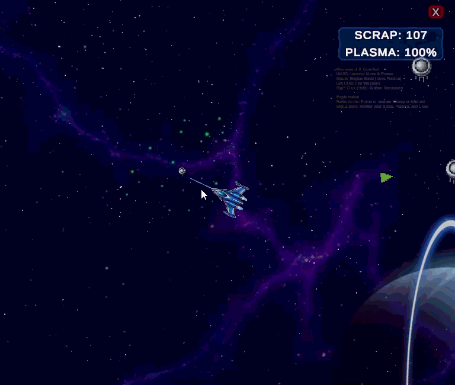

# Project: StarDrift & Strike

An infinite space exploration and combat prototype built in Unity. This project balances the calm, strategic resource gathering of "Drift Mode" with the high-octane, arena-based "Strike Mode."

## 👀 Previews



## 🚀 Current State of Development

The prototype currently features:

- **Infinite World Generation:** Grid-based chunk spawning (50x50) with floating origin reset to handle infinite coordinates.
- **Dual Gameplay Loop:**
  - **Drift Mode:** Strategic navigation, resource siphoning (Scrap/Plasma), and basic defense.
  - **Strike Mode:** Fast-paced arena combat triggered by enemy interception.
- **Advanced AI:** Scouter enemies with strafing, burst-fire patterns, and a "Charge" mechanic to force engagement.
- **Persistent Systems:** Global Game Data singleton managing Lives, Scrap, and Plasma across scenes.
- **Dynamic Visuals:** Randomized background decoration (Planets/Nebula) and siphoning beam effects.

## 📝 Game Design Document (GDD) Summary

### **Core Loop**

1. **Explore:** Navigate infinite space using physics-based movement.
2. **Scavenge:** Siphon asteroids for Scrap (currency) and Plasma (fuel/boost).
3. **Engage:** Combat scouter ships to earn high-tier rewards or survive forced Strike Mode encounters.
4. **Upgrade:** Use collected resources to improve ship stats (Planned).

### **Technical Pillars**

- **MVC Architecture:** Separation of Data (Models), UI (Views), and Logic (Controllers).
- **Optimization:** Heavy use of Object Pooling for projectiles, enemies, and environmental effects.
- **Risk/Reward:** Dying in Strike Mode results in a 50% Scrap penalty, encouraging tactical retreats using the Boost mechanic.

## 🛠 Credits & Third-Party Content

The **Strike Mode** combat gameplay is powered by the [MinimalShooting](https://github.com/sunduk/MinimalShooting) package by **sunduk**.

_Note: While the core combat logic is derived from this package, we have significantly modified the visuals, input handling, and scene transition logic to integrate it seamlessly into our infinite drifting universe._

---

### **2. README_ES.md (Spanish)**

```markdown
# Proyecto: StarDrift & Strike

Un prototipo de exploración y combate espacial infinito desarrollado en Unity. Este proyecto equilibra la recolección calmada y estratégica de recursos en el "Modo Drift" con el combate intenso en arenas del "Modo Strike".

## 🚀 Estado Actual del Desarrollo

El prototipo cuenta actualmente con:

- **Generación de Mundo Infinito:** Generación de fragmentos (chunks) basada en cuadrícula (50x50) con reinicio de origen flotante para manejar coordenadas infinitas.
- **Bucle de Juego Dual:**
  - **Modo Drift:** Navegación estratégica, succión de recursos (Chatarra/Plasma) y defensa básica.
  - **Modo Strike:** Combate rápido en arena activado por la interceptación de enemigos.
- **IA Avanzada:** Enemigos tipo "Scouter" con movimiento lateral (strafing), ráfagas de disparo y mecánica de "Carga" para forzar el combate.
- **Sistemas Persistentes:** Singleton de datos globales que gestiona Vidas, Chatarra y Plasma entre escenas.
- **Visuales Dinámicos:** Decoración de fondo aleatoria (Planetas/Nebulosas) y efectos de rayo extractor.

## 📝 Resumen del Documento de Diseño (GDD)

### **Bucle Principal (Core Loop)**

1. **Explorar:** Navegar por el espacio infinito usando movimiento basado en física.
2. **Recolectar:** Extraer Chatarra (moneda) y Plasma (combustible/impulso) de los asteroides.
3. **Combatir:** Enfrentar naves exploradoras para ganar recompensas de alto nivel o sobrevivir encuentros forzados.
4. **Mejorar:** Utilizar recursos recolectados para mejorar las estadísticas de la nave (Planeado).

### **Pilares Técnicos**

- **Arquitectura MVC:** Separación de Datos (Modelos), Interfaz (Vistas) y Lógica (Controladores).
- **Optimización:** Uso intensivo de Object Pooling para proyectiles, enemigos y efectos ambientales.
- **Riesgo/Recompensa:** Morir en el Modo Strike resulta en una penalización del 50% de la Chatarra, fomentando retiradas tácticas usando la mecánica de Impulso (Boost).

## 🛠 Créditos y Contenido de Terceros

El sistema de combate del **Modo Strike** utiliza el paquete [MinimalShooting](https://github.com/sunduk/MinimalShooting) de **sunduk**.

_Nota: Aunque la lógica central de combate se deriva de este paquete, hemos modificado significativamente los visuales, el manejo de inputs y la lógica de transición entre escenas para integrarlo perfectamente en nuestro universo infinito._
```
